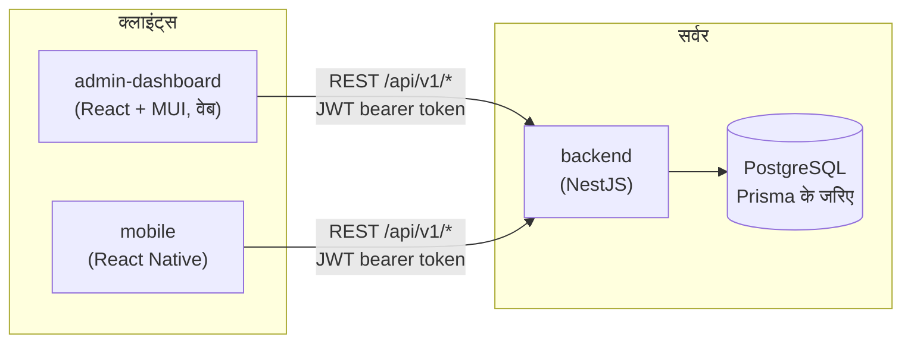
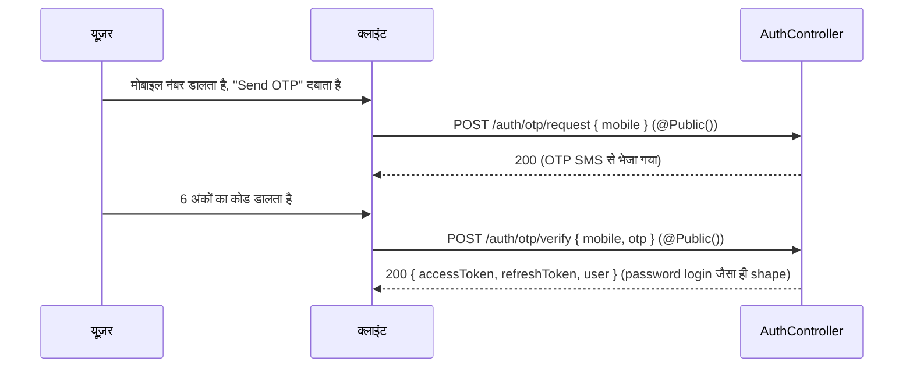
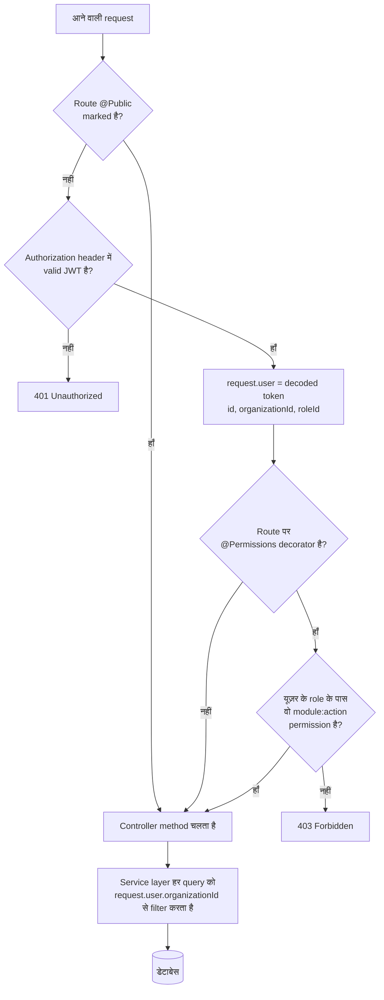
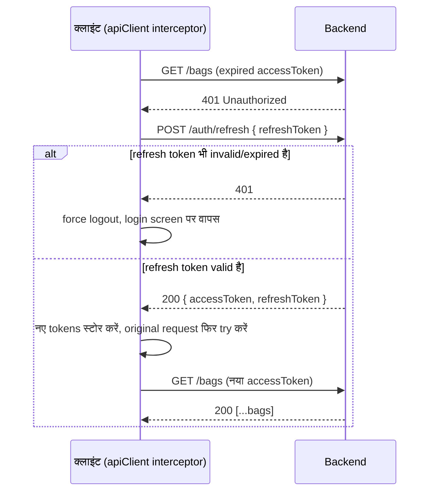

# 01 — सिस्टम ओवरव्यू और लॉगिन फ्लो

तीनों ऐप्स आपस में कैसे जुड़ी हैं, और पासवर्ड टाइप करने से लेकर स्क्रीन दिखने
तक ठीक-ठीक क्या होता है। यहाँ हर बात असली कोड से verify की गई है (file paths
दिए गए हैं) — कुछ भी अंदाजे से नहीं लिखा गया।

---

## 1. तीन ऐप्स, एक बैकएंड



- **backend** ही अकेला हिस्सा है जो डेटाबेस से बात करता है। कोई भी फ्रंटएंड
  सीधे Postgres को query नहीं करता।
- दोनों फ्रंटएंड एक ही तरीके से authenticate होते हैं (JWT access + refresh
  token) और एक ही REST API हिट करते हैं — बस वेब ऐप में ज़्यादा modules
  (settings, roles, audit log) हैं जो field में मोबाइल ऐप को नहीं चाहिए।
- जो भी request `@Public()` से explicitly mark नहीं है, उसे **हमेशा** एक
  valid JWT चाहिए। यह globally लागू होता है (`backend/src/app.module.ts`
  में `JwtAuthGuard` + `RbacGuard` से), हर controller में अलग-अलग नहीं — इसलिए
  कोई नया module बनाने वाला developer भी auth enforcement बिना कुछ किए
  पाता है, भूल नहीं सकता।

---

## 2. लॉगिन — स्टेप बाय स्टेप

### 2a. पासवर्ड लॉगिन (वेब + मोबाइल, दोनों में backend flow same है)

```mermaid
sequenceDiagram
    participant U as यूज़र
    participant C as क्लाइंट (web/mobile)
    participant A as AuthController
    participant S as AuthService
    participant DB as डेटाबेस

    U->>C: ईमेल/मोबाइल + पासवर्ड डालता है, "Sign in" दबाता है
    C->>A: POST /api/v1/auth/login { email|mobile, password }
    Note over A: @Public() — यहाँ पहुँचने के लिए JWT नहीं चाहिए
    A->>S: login(dto)
    S->>DB: email/mobile से यूज़र खोजें
    alt यूज़र नहीं मिला या inactive है
        S-->>C: 401 "Invalid credentials"
    else यूज़र मिल गया
        S->>S: argon2.verify(password, user.passwordHash)
        alt पासवर्ड गलत
            S-->>C: 401 "Invalid credentials"
        else पासवर्ड सही
            S->>S: accessToken (short-lived) + refreshToken (long-lived) साइन करें
            S-->>C: 200 { accessToken, refreshToken, user }
            C->>C: tokens स्टोर करें (web: memory/localStorage — authSlice.js;<br/>mobile: OS Keychain/Keystore — sessionStorage.js)
            C->>C: /dashboard (web) या AdminStack/CustomerTabNavigator (mobile) पर redirect
        end
    end
```

यह कहाँ है: `backend/src/modules/auth/auth.controller.ts` →
`auth.service.ts`। मोबाइल की तरफ, `mobile/src/store/sessionStorage.js` —
tokens encrypted Keychain/Keystore में जाते हैं, कभी plain storage में नहीं।

### 2b. OTP लॉगिन (मुख्यतः mobile के लिए, वेब पर भी उपलब्ध)



### 2c. JWT के अंदर क्या है, और यह आगे हर जगह क्यों मायने रखता है

Access token के payload में `userId`, `organizationId`, और `roleId` होते हैं।
हर एक business endpoint इसी token से `organizationId` निकालता है
(`@CurrentUser()` decorator के जरिए — देखें
`common/decorators/current-user.decorator.ts`) और हर database query को
इसी से scope करता है। **यही एक field पूरी tenant boundary है** — यही वजह है
कि Warehouse Org A का admin कभी Warehouse Org B के bags, dispatches,
cameras, या users नहीं देख सकता, चाहे वो कोई भी ID guess करे या URL में
टाइप करे।

### 2d. लॉगिन के बाद हर request



यह flow (`JwtAuthGuard` → `RbacGuard` → controller → service) **हर**
request पर चलता है — bags, warehouses, farmers, billing, सब कुछ। यह एक ही
जगह, globally, `app.module.ts` में register है, हर controller में
copy-paste नहीं किया गया।

### 2e. Token refresh (silent, यूज़र को दिखता नहीं)

Access tokens जानबूझकर short-lived रखे गए हैं। जब session के बीच में एक
expire हो जाता है, API client यूज़र को logout नहीं करता — चुपचाप refresh
token से नया pair ले आता है और original request को एक बार फिर try करता है:



---

## 3. Roles — क्या-क्या हैं, और हर एक का मतलब क्या है

`backend/src/database/prisma/seed.ts` में seed किए गए हैं। ये **system role
templates** हैं (हर organization में share होते हैं, `organizationId: null`)
— एक org अपने खुद के **custom roles** भी बना सकता है जो सिर्फ उसी org तक
सीमित होते हैं, उसी permission catalog से बनाए गए।

| Role | किसके लिए है |
|---|---|
| `SUPER_ADMIN` | हर module, हर action पर पूरा access — यही अकेला role है जिसे शुरू से सारे permissions मिले हैं। पहली बार इसी से लॉगिन करते हैं (bootstrap account `admin@awms.local`)। |
| `WAREHOUSE_OWNER` | व्यवसाय का मालिक — platform-level settings को छोड़कर लगभग सब कुछ |
| `WAREHOUSE_MANAGER` | एक या कई warehouses का रोज़ाना operational control |
| `SUPERVISOR` | फ्लोर-लेवल निगरानी — inventory, dispatch, quality |
| `OPERATOR` | फ्रंट-लाइन स्टाफ — bags स्कैन करना, weighbridge entries दर्ज करना |
| `ACCOUNTANT` | Billing, payments, financial reports |
| `SECURITY_GUARD` | Gate pass verification, CCTV |
| `FARMER` | Customer-facing role — देखें file 03 यह role असल में क्या कर सकता है |
| `AUDITOR` | Audit log और reports का read-only access |
| `VIEWER` | सामान्य read-only |

**Permissions असल में कैसे काम करते हैं:** seed सिर्फ `SUPER_ADMIN` को
pre-configure करता है। बाकी हर role शुरू में **शून्य** permissions के साथ
शुरू होता है — किसी `SUPER_ADMIN` (या org के अपने `WAREHOUSE_OWNER`-जैसे
किसी user) को **Roles & Permissions** (web) में जाकर explicitly बताना
होता है कि हर role को कौन-कौन से `module:action` pairs मिलेंगे। यह जानबूझकर
है: इसका मतलब है कि हर org यह तय कर सकता है कि उनका `SECURITY_GUARD` या
`OPERATOR` क्या-क्या छू सकता है, बजाय एक जैसे preset के सब पर थोपने के।

Permission catalog एक fixed grid है — नीचे दिया हर module, `create` /
`read` / `update` / `delete` के साथ:

```
warehouses · farmers · crops · inventory · quality · weighbridge ·
billing · payments · dispatch · cctv · reports · employees ·
settings · notifications · documents · audit-log
```

### "Super Admin" बनाम "Admin" — शब्दों का भ्रम साफ करना

Database में "Admin" नाम की कोई अलग चीज़ नहीं है जो "Super Admin" से अलग हो
— `SUPER_ADMIN` **ही** सबसे ऊपर का role है। लोग बोलचाल में जिसे "Admin"
कहते हैं, वो आमतौर पर इन दो में से एक चीज़ होती है:

1. **मोबाइल पर**: जिस भी यूज़र के `roleName` में "admin" शब्द है
   (case-insensitive — देखें `mobile/src/store/slices/authSlice.js` में
   `selectIsAdmin`), वो **AdminStack** (warehouse-side view) में जाता है,
   न कि **CustomerTabNavigator** (farmer-side view) में। तो `SUPER_ADMIN`,
   कोई `WAREHOUSE_MANAGER`-अगर-"admin"-शब्द-से-rename-हुआ-हो, या कोई custom
   org role जिसका नाम हो जैसे "Branch Admin" — ये सब यहीं पहुँचेंगे — यह
   एक string match है, कोई fixed role ID नहीं।
2. **वेब पर**: कोई अलग "admin app" नहीं है — admin-dashboard *ही*
   admin/staff-facing ऐप है। हर warehouse-side role (`SUPER_ADMIN` से
   `OPERATOR` तक) यही एक वेब ऐप इस्तेमाल करता है; फर्क सिर्फ इतना होता है कि
   उन्हें कौन-से nav items और buttons दिखते हैं, जो पूरी तरह उनके permission
   set पर निर्भर करता है (देखें file 02, section 1)।

File 03 उस एक role को cover करती है जो admin-dashboard बिल्कुल इस्तेमाल
नहीं करता: `FARMER`, जो सिर्फ मोबाइल ऐप का customer view देखता है।
