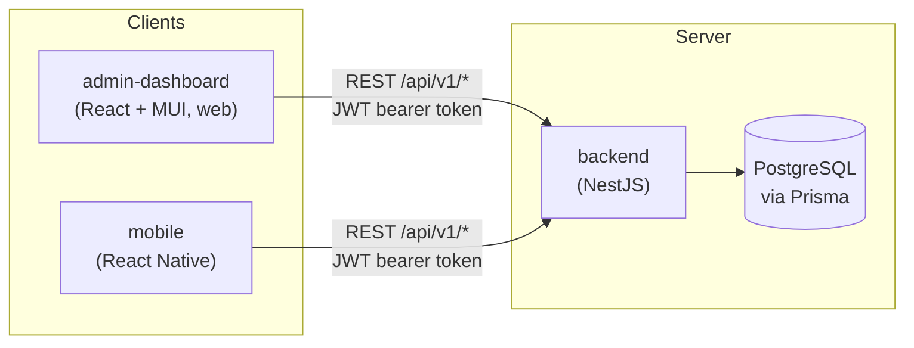
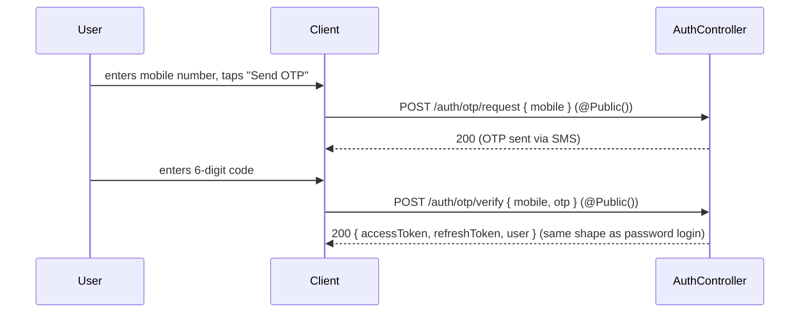
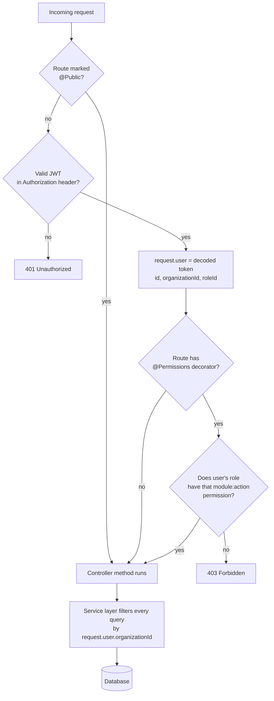
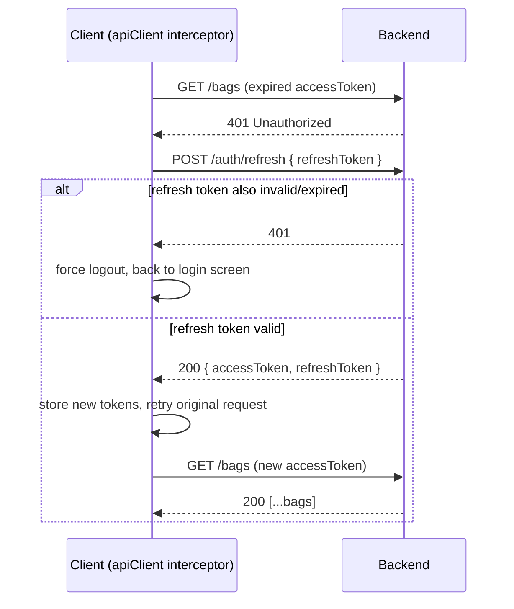

# 01 — System Overview & Login Flow

How the three apps fit together, and exactly what happens from the moment
someone types their password to the moment a screen renders. Every claim
here is traced to the actual code (file paths given) — nothing invented.

---

## 1. The three apps, one backend



- **backend** is the only thing that talks to the database. Neither
  frontend ever queries Postgres directly.
- Both frontends authenticate the same way (JWT access + refresh token)
  and hit the same REST API — the web app just exposes more modules
  (settings, roles, audit log) that the mobile app doesn't need in the
  field.
- **Every** request that isn't explicitly marked `@Public()` requires a
  valid JWT. This is enforced globally in `backend/src/app.module.ts` via
  `JwtAuthGuard` + `RbacGuard`, not per-controller — so a developer adding
  a brand-new module gets auth enforcement for free, they can't forget it.

---

## 2. Login — step by step

### 2a. Password login (web + mobile, identical backend flow)

```mermaid
sequenceDiagram
    participant U as User
    participant C as Client (web/mobile)
    participant A as AuthController
    participant S as AuthService
    participant DB as Database

    U->>C: enters email/mobile + password, taps "Sign in"
    C->>A: POST /api/v1/auth/login { email|mobile, password }
    Note over A: @Public() — no JWT required to reach this endpoint
    A->>S: login(dto)
    S->>DB: find user by email/mobile
    alt user not found or inactive
        S-->>C: 401 "Invalid credentials"
    else user found
        S->>S: argon2.verify(password, user.passwordHash)
        alt password wrong
            S-->>C: 401 "Invalid credentials"
        else password correct
            S->>S: sign accessToken (short-lived) + refreshToken (long-lived)
            S-->>C: 200 { accessToken, refreshToken, user }
            C->>C: store tokens (web: memory/localStorage via authSlice;<br/>mobile: OS Keychain/Keystore — see sessionStorage.js)
            C->>C: redirect to /dashboard (web) or AdminStack/CustomerTabNavigator (mobile)
        end
    end
```

Where this lives: `backend/src/modules/auth/auth.controller.ts` →
`auth.service.ts`. On mobile, the receiving end is
`mobile/src/store/sessionStorage.js` — tokens go into the encrypted
Keychain/Keystore, never plain storage.

### 2b. OTP login (mobile-first pattern, also on web)



### 2c. What's inside the JWT, and why it matters everywhere downstream

The access token's payload carries `userId`, `organizationId`, and
`roleId`. Every single business endpoint pulls `organizationId` out of
this token (via `@CurrentUser()`, see `common/decorators/current-user.decorator.ts`)
and uses it to scope every database query. **This one field is the entire
tenant boundary** — it's why an admin at Warehouse Org A can never see
Warehouse Org B's bags, dispatches, cameras, or users, no matter what ID
they guess or type into a URL.

### 2d. Every request after login



This flow (`JwtAuthGuard` → `RbacGuard` → controller → service) runs on
**every** request to every module — bags, warehouses, farmers, billing,
everything. It's registered once, globally, in `app.module.ts`, not
copy-pasted into each controller.

### 2e. Token refresh (silent, invisible to the user)

Access tokens are short-lived on purpose. When one expires mid-session,
the API client doesn't log the user out — it silently exchanges the
refresh token for a new pair and retries the original request once:



---

## 3. Roles — what exists, and what each one means

Seeded in `backend/src/database/prisma/seed.ts`. These are **system
role templates** (shared across every organization, `organizationId:
null`) — an org can additionally define its own **custom roles** scoped
to just that org, built from the same permission catalog.

| Role | Intended for |
|---|---|
| `SUPER_ADMIN` | Full access to every module, every action — the only role seeded with all permissions out of the box. This is who you log in as first (bootstrap account `admin@awms.local`). |
| `WAREHOUSE_OWNER` | Business owner — broad access, typically everything except platform-level settings |
| `WAREHOUSE_MANAGER` | Day-to-day operational control of one or more warehouses |
| `SUPERVISOR` | Floor-level oversight — inventory, dispatch, quality |
| `OPERATOR` | Front-line staff — scanning bags, recording weighbridge entries |
| `ACCOUNTANT` | Billing, payments, financial reports |
| `SECURITY_GUARD` | Gate pass verification, CCTV |
| `FARMER` | The customer-facing role — see file 03 for what this role can actually do |
| `AUDITOR` | Read-only access to the audit log and reports |
| `VIEWER` | Read-only, general |

**How permissions actually work:** the seed only pre-configures
`SUPER_ADMIN`. Every other role starts with **zero** permissions — a
`SUPER_ADMIN` (or an org's own `WAREHOUSE_OWNER`-equivalent) has to go
into **Roles & Permissions** (web) and explicitly tick which
`module:action` pairs each role gets. This is intentional: it means an
org can tailor exactly what a `SECURITY_GUARD` or `OPERATOR` can touch
rather than inheriting a one-size-fits-all preset.

The permission catalog is a fixed grid — every module below crossed with
`create` / `read` / `update` / `delete`:

```
warehouses · farmers · crops · inventory · quality · weighbridge ·
billing · payments · dispatch · cctv · reports · employees ·
settings · notifications · documents · audit-log
```

### "Super Admin" vs "Admin" — clearing up the terminology

There is no separate database concept called "Admin" distinct from
"Super Admin" — `SUPER_ADMIN` **is** the top role. What people
colloquially call "Admin" in this system is usually one of two things:

1. **On mobile**: any user whose `roleName` contains the text "admin"
   (case-insensitive — see `selectIsAdmin` in
   `mobile/src/store/slices/authSlice.js`) gets routed into the
   **AdminStack** (warehouse-side view) instead of the **CustomerTabNavigator**
   (farmer-side view). So `SUPER_ADMIN`, `WAREHOUSE_MANAGER`-if-renamed-with-"admin",
   or a custom org role literally named e.g. "Branch Admin" would all
   land here — it's a string match, not a fixed role ID.
2. **On web**: there's no separate "admin app" — the admin-dashboard
   *is* the admin/staff-facing app. Every warehouse-side role
   (`SUPER_ADMIN` down to `OPERATOR`) uses the same web app; what differs
   is which nav items and buttons they actually see, driven entirely by
   their permission set (see file 02, section 1).

File 03 covers the one role that does NOT use the admin-dashboard at
all: `FARMER`, who only ever sees the mobile app's customer view.
