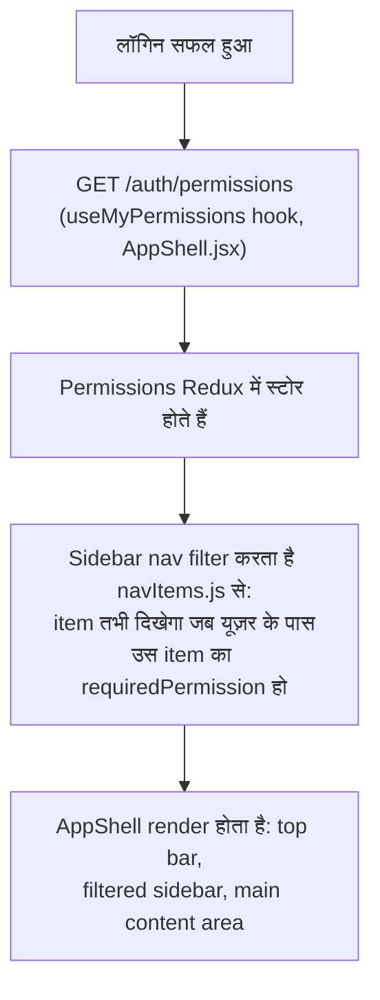
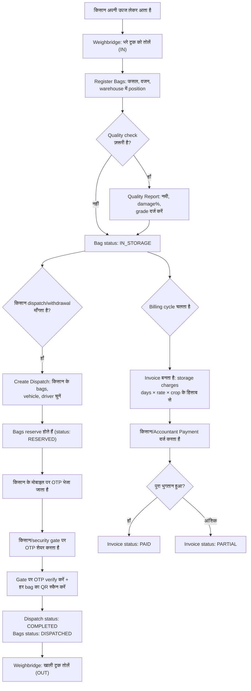
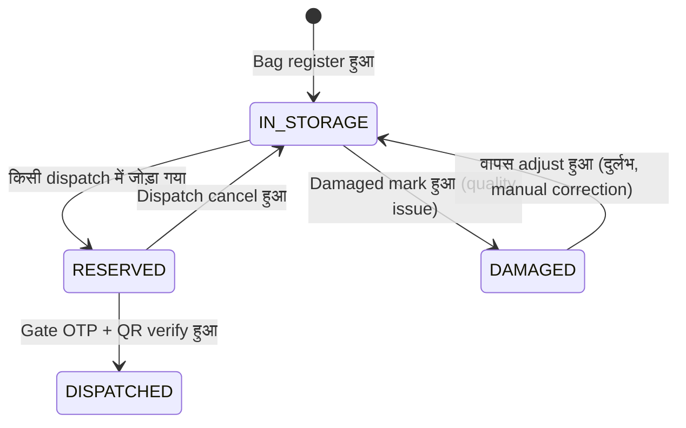

# 02 — Super Admin / Admin (वेब डैशबोर्ड) वर्कफ़्लो

`admin-dashboard` में लॉगिन करने के बाद warehouse-side यूज़र (`SUPER_ADMIN`
से लेकर `OPERATOR`, `ACCOUNTANT`, `SECURITY_GUARD`, आदि) जो कुछ भी करता है
वो सब यहाँ है। एक ही ऐप, permission से gated — देखें file 01 §3 यह कैसे
काम करता है।

---

## 1. लॉगिन के बाद क्या दिखता है — permission-driven UI

`SUPER_ADMIN` को हर nav item दिखता है (Dashboard, Warehouses, Farmers,
Crops, Inventory, Weighbridge, Billing, Payments, Dispatch, Reports,
CCTV, Employees, Notifications, Documents, Users & Roles, Settings,
Audit Log)। एक `OPERATOR` जिसके role में सिर्फ `inventory:read` +
`dispatch:read` tick हैं, उसे सिर्फ Dashboard, Inventory, और Dispatch
दिखते हैं — बाकी सब disabled नहीं, बल्कि पूरी तरह invisible हैं। यह सिर्फ
UI की politeness है; backend पर `RbacGuard` ही असल में request को रोकता है
भले ही कोई UI को bypass करके सीधे API कॉल कर दे।

Top-bar के **search icon** पर क्लिक करने (या `⌘K`/`Ctrl+K`) से command
palette खुलता है — टाइप करके filter करें, किसी result पर क्लिक करके सीधे
उस module पर पहुँच जाएं (`AppShell.jsx`, `CommandPalette`)। **globe/translate
icon** पूरे UI को English और Hindi के बीच instantly बदल देता है, बिना
reload किए (`LanguageSwitcher.jsx`)। **bell icon** Notifications पर ले
जाता है; **avatar** Profile / Sign out खोलता है।

---

## 2. पूरा business flow — किसान के आने से लेकर payment तक

यही वो backbone flow है जो हर warehouse चलाता है, और नीचे दिए ज़्यादातर
modules इसी को support करने के लिए हैं। पहले diagram, फिर हर step यह बताते
हुए कि कौन-सी screen/button उसे चलाती है।

Bag status machine (backend से enforced, सिर्फ UI convention नहीं):

---

## 3. Module-by-module: हर क्लिक पर क्या होता है

### Dashboard
लॉगिन के बाद landing page। Cards में live counts दिखते हैं — कुल bags
storage में, आज के dispatches, pending invoices, active farmers,
warehouse occupancy — यह सब `GET /dashboard/summary` से आता है, लॉगिन
किए यूज़र के organization तक scoped। यहाँ कोई write action नहीं है; यह
सिर्फ read-only cockpit है। किसी भी stat card पर क्लिक करने से उस
module की list page खुल जाती है।

### Warehouses
**List view**: आपके org का हर warehouse, occupancy bar के साथ। किसी row
पर क्लिक करने से **Warehouse Detail** खुलता है, जो पूरे physical layout
(Zone → Block → Row → Rack → Level → Position) को color-coded map की
तरह दिखाता है — हरा = खाली, पीला = आंशिक भरा, लाल = पूरा भरा, स्लेटी =
disabled (`WarehouseMap.jsx`)। किसी भी level पर **"Add"** पर क्लिक करने
से `AddNodeDialog` खुलता है जिससे उसी के नीचे नया zone/block/row/rack/
level/position बनाया जा सकता है। यही structure है जिसे बाकी पूरे ऐप में
"Position" कहा जाता है (bag का exact physical location)।

### Farmers
Search के साथ **List view**। **"+ New Farmer"** पर क्लिक करने से form
खुलता है (नाम, मोबाइल, गांव, ज़िला, Aadhaar/PAN docs `FileDropzone` के
जरिए)। किसी row पर क्लिक करने से **Farmer Detail** खुलता है — उनकी
profile, अभी storage में मौजूद उनके सारे bags, पूरी dispatch history,
और उनका बकाया (Payments module के `GET /farmers/:id/outstanding` से
आता है)।

### Crops
पूरे सिस्टम में shared reference catalog (गेहूं, चावल, आदि) — यह
per-organization नहीं है, क्योंकि ये सामान्य कृषि शब्द हैं। हर crop की
default billing rate, ideal storage temperature/humidity, और shelf life
यहीं defined है। जहाँ भी bag बनाया जाता है वहाँ dropdown में यही
इस्तेमाल होता है।

### Inventory (Bags)
Paginated **List view**, crop/status/farmer से filter करने योग्य। किसी
bag पर क्लिक करने से **Bag Detail** खुलता है: पूरी history (हर movement,
हर quality report), current position, और action buttons — **Move**
(physical position बदलें), **Adjust** (वजन/status ठीक करें), **Mark
Damaged**। **QR Resolve** page वही है जो warehouse worker के फोन का
camera hit करता है जब किसी bag का printed QR code स्कैन करता है — नाम से
खोजने के बजाय code से तुरंत bag ढूंढ लेता है।

### Weighbridge
दो buttons: **Weigh IN** और **Weigh OUT**। हर एक से form खुलता है —
vehicle number, gross weight, tare weight — net weight अपने आप compute
होता है, और अगर gross < tare हो तो सिस्टम इसे reject कर देता है। एक
printable slip बनता है (असली PDF, `PdfUtil.renderWeighbridgeSlip`)।
चाहें तो किसी farmer से link कर सकते हैं।

### Billing
Invoices को status chips (Pending / Partial / Paid / Overdue) के साथ
list करता है। किसी पर क्लिक करने से **Invoice Detail** खुलता है —
itemized charges (bag के हिसाब से, दिन के हिसाब से, crop की rate के
हिसाब से), और एक **Record Payment** button जो इसी invoice से pre-filled
Payments flow खोलता है।

### Payments
हर payment/refund transaction, farmer से searchable। **"+ New Payment"**
से form खुलता है: farmer चुनें, चाहें तो invoice link करें, amount,
method (cash/UPI/bank transfer), reference number। Payment दर्ज करते ही
linked invoice का status (Partial बनाम Paid) अपने आप recompute हो जाता
है। किसी भी payment पर **Refund** button उसी invoice के खिलाफ negative
transaction दर्ज करता है — यह original payment को कभी delete नहीं करता,
इसलिए audit trail बरकरार रहती है।

### Dispatch
**List view** → किसी dispatch पर क्लिक करने से उसका status और bags
दिखते हैं। **"+ New Dispatch"**: किसी farmer को चुनें, उनके storage में
मौजूद bags में से चुनें कि कौन से release करने हैं, vehicle/driver
details डालें → submit करते ही वो bags reserve हो जाते हैं और farmer को
OTP भेज दिया जाता है। **Verify OTP** screen (gate पर इस्तेमाल होती है,
अक्सर `SECURITY_GUARD` द्वारा) code के साथ-साथ लोड हो रहे हर bag का QR
scan भी लेती है, यह cross-check करती है कि scan किए गए bags dispatch से
पूरी तरह मेल खाते हैं, और तभी इसे `COMPLETED` mark करके gate pass PDF
बनाती है। **Cancel** (सिर्फ तब जब अभी भी `PENDING` हो) reserved bags को
वापस `IN_STORAGE` कर देता है।

### Reports
Report type चुनें (Inventory, Farmers, Crops, Warehouse Occupancy,
Revenue, Pending Bills, Damage, Dispatch) और export format (CSV या
Excel) → सीधे download हो जाता है, कोई preview screen नहीं।

### CCTV
हर warehouse के cameras का grid, live status के हिसाब से color-coded
(online / offline / maintenance — health-check webhook से push होता है,
poll नहीं किया जाता)। किसी camera पर क्लिक करने से उसकी live stream
खुलती है। **"+ Add Camera"** के लिए RTSP URL और credentials चाहिए — ये
encrypted रहते हैं और सिर्फ server-side पर तभी decrypt होते हैं जब कोई
permitted यूज़र stream मांगे।

### Employees
दो tabs: **Directory** (staff जोड़ें/edit करें, designation, shift,
salary) और **Attendance & Leave** — रोज़ाना attendance mark करें, और एक
leave-request queue जहाँ manager Approve/Reject क्लिक करता है।

### Notifications
System events की feed (dispatch OTP भेजा गया, camera offline हुआ, leave
request pending है, आदि) जो लॉगिन किए यूज़र से जुड़ी हैं।

### Documents
हर uploaded file (Aadhaar/PAN, invoices, gate passes, quality photos)
एक जगह, farmer या linked entity से searchable।

### Users & Roles
**Users tab**: आपके org में हर staff account — user बनाएं
(नाम/ईमेल/मोबाइल/पासवर्ड/role), edit करें, deactivate करें। **Roles
tab**: custom role बनाएं (शून्य permissions से शुरू होता है), फिर एक
permission matrix — हर module × action के लिए checkboxes — save करके
लागू करें। यही वो screen है जो असल में तय करती है कि कोई `OPERATOR` या
कोई custom "Branch Manager" role बाकी पूरे ऐप में क्या देख और कर सकता है।

### Settings
Organization-level configuration — business name, address, default
billing rates, notification preferences।

### Audit Log
Read-only, user/module/date range से filterable। पूरे सिस्टम में हर
mutating action अपने आप यहाँ एक row लिखता है (`AuditInterceptor`) — किसने
क्या किया, कब किया, पुराना value बनाम नया value। ऊपर बताए हर काम के लिए
यही accountability trail है।

---

## 4. "Super Admin" असल में बाकी हर role से कैसे अलग है

Functionally, `SUPER_ADMIN` बिल्कुल वही screens इस्तेमाल करता है जो बाकी
सब — कोई छिपा हुआ "super admin panel" नहीं है। फर्क सिर्फ permissions का
है:

- सिर्फ `SUPER_ADMIN` को शुरू से हर `module:action` pre-granted मिलता है
  (seed data से)। बाकी हर role — custom roles समेत जो कोई org बनाता है —
  खाली शुरू होता है और उसे **Users & Roles → Roles tab** से explicitly
  configure करना पड़ता है।
- असल में, किसी नए organization के `SUPER_ADMIN` (या जिसके पास वो
  bootstrap login है) का पहला काम यही होता है: org के असली staff accounts
  बनाना, उनके लिए custom roles बनाना/tune करना, और तभी day-to-day काम
  `WAREHOUSE_MANAGER`/`OPERATOR`/`ACCOUNTANT` accounts को सौंपना।
