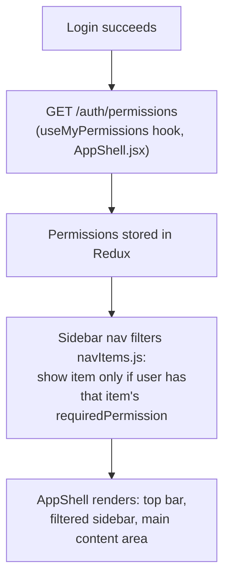
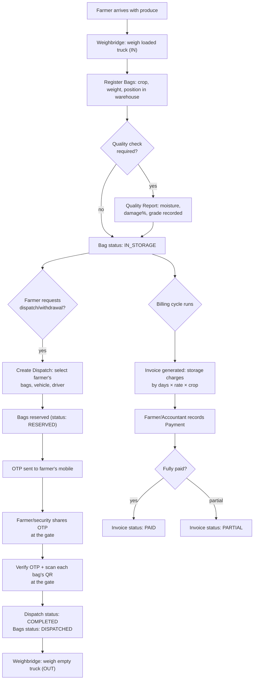
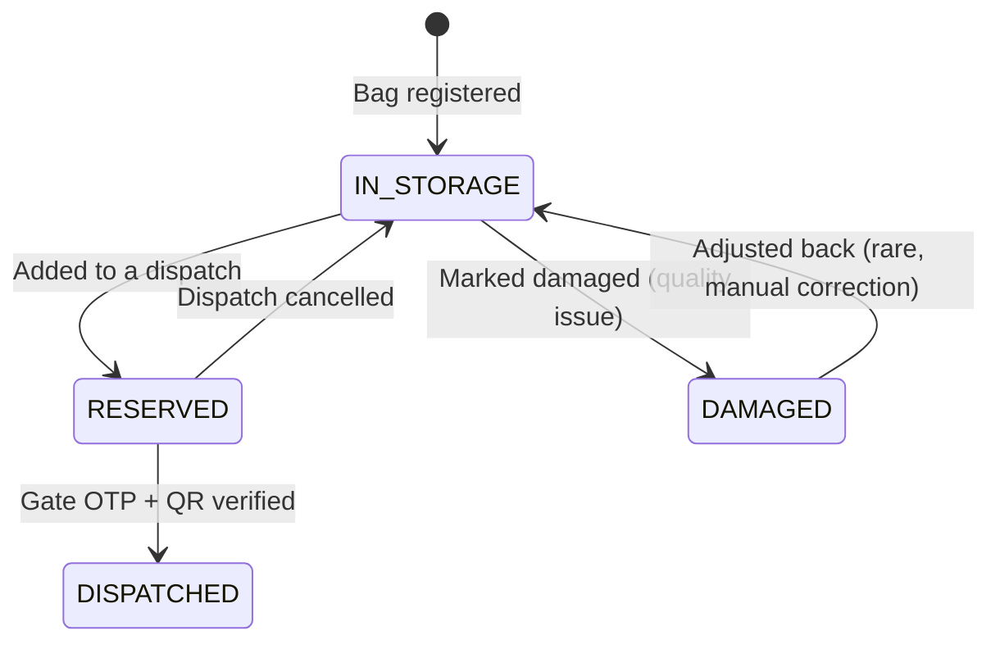

# 02 — Super Admin / Admin (Web Dashboard) Workflow

Everything a warehouse-side user (`SUPER_ADMIN` down to `OPERATOR`,
`ACCOUNTANT`, `SECURITY_GUARD`, etc.) does after logging into
`admin-dashboard`. One app, permission-gated — see file 01 §3 for how
that gating works.

---

## 1. What renders after login — permission-driven UI

A `SUPER_ADMIN` sees every nav item (Dashboard, Warehouses, Farmers,
Crops, Inventory, Weighbridge, Billing, Payments, Dispatch, Reports,
CCTV, Employees, Notifications, Documents, Users & Roles, Settings,
Audit Log). An `OPERATOR` with only `inventory:read` + `dispatch:read`
ticked in their role sees just Dashboard, Inventory, and Dispatch — the
rest are invisible, not just disabled. This is UI politeness only;
`RbacGuard` on the backend is what actually blocks the request even if
someone bypasses the UI and calls the API directly.

Clicking the top-bar **search icon** (or `⌘K`/`Ctrl+K`) opens the
command palette — type to filter, click a result to jump straight to
that module (`AppShell.jsx`, `CommandPalette`). The **globe/translate
icon** switches the whole UI between English and Hindi instantly, no
reload (`LanguageSwitcher.jsx`). The **bell icon** goes to
Notifications; the **avatar** opens Profile / Sign out.

---

## 2. End-to-end business flow — from farmer arrival to payment

This is the backbone flow every warehouse runs, and it's what most of
the modules below exist to support. Diagram first, then each step
explained with exactly which screen/button drives it.

Bag status machine (enforced by the backend, not just UI convention):

---

## 3. Module-by-module: what happens on each click

### Dashboard
Landing page after login. Cards show live counts — total bags in
storage, today's dispatches, pending invoices, active farmers,
warehouse occupancy — pulled from `GET /dashboard/summary`, scoped to
the logged-in user's organization. No write actions here; it's a
read-only cockpit. Clicking any stat card navigates to that module's
list page.

### Warehouses
**List view**: every warehouse in your org, with an occupancy bar.
Clicking a row opens **Warehouse Detail**, which renders the nested
physical layout (Zone → Block → Row → Rack → Level → Position) as a
color-coded map — green = empty, yellow = partial, red = full, grey =
disabled (`WarehouseMap.jsx`). Clicking **"Add"** at any level opens
`AddNodeDialog` to create a new zone/block/row/rack/level/position
under the one you clicked. This structure is what "Position" means
everywhere else in the app (a bag's exact physical location).

### Farmers
**List view** with search. Clicking **"+ New Farmer"** opens a form
(name, mobile, village, district, Aadhaar/PAN docs via
`FileDropzone`). Clicking a row opens **Farmer Detail** — their profile,
every bag they currently have in storage, their full dispatch history,
and their outstanding balance (pulled from the Payments module's
`GET /farmers/:id/outstanding`).

### Crops
Reference catalog (Wheat, Rice, etc.) shared across the whole system —
not per-organization, since these are generic agricultural terms.
Defines default billing rate, ideal storage temperature/humidity, and
shelf life per crop. Used as a dropdown everywhere a bag is created.

### Inventory (Bags)
**List view**, paginated, filterable by crop/status/farmer. Clicking a
bag opens **Bag Detail**: full history (every movement, every quality
report), current position, and action buttons — **Move** (change
physical position), **Adjust** (correct weight/status), **Mark
Damaged**. The **QR Resolve** page is what a warehouse worker's phone
camera hits when scanning a bag's printed QR code — looks the bag up
instantly by code instead of searching by name.

### Weighbridge
Two buttons: **Weigh IN** and **Weigh OUT**. Each opens a form for
vehicle number, gross weight, tare weight — net weight is computed
automatically, and the system rejects it if gross < tare. Produces a
printable slip (real PDF, `PdfUtil.renderWeighbridgeSlip`). Optionally
linked to a farmer.

### Billing
Lists invoices with status chips (Pending / Partial / Paid / Overdue).
Clicking one opens **Invoice Detail** — itemized charges (per bag, per
day, per crop's rate), and a **Record Payment** button that opens the
Payments flow pre-filled with this invoice.

### Payments
Every payment/refund transaction, searchable by farmer. **"+ New
Payment"** opens a form: select farmer, optionally link an invoice,
amount, method (cash/UPI/bank transfer), reference number. Recording a
payment automatically recomputes the linked invoice's status (Partial
vs Paid). A **Refund** button on any payment records a negative
transaction against the same invoice — it never deletes the original
payment, so the audit trail stays intact.

### Dispatch
**List view** → clicking a dispatch shows its status and bags.
**"+ New Dispatch"**: pick a farmer, pick which of their in-storage
bags to release, enter vehicle/driver details → submit reserves those
bags and texts an OTP to the farmer. The **Verify OTP** screen (used at
the gate, often by `SECURITY_GUARD`) takes the code plus a QR scan of
every bag being loaded, cross-checks that the scanned bags match the
dispatch exactly, and only then marks it `COMPLETED` and generates the
gate pass PDF. **Cancel** (only while still `PENDING`) releases the
reserved bags back to `IN_STORAGE`.

### Reports
Pick a report type (Inventory, Farmers, Crops, Warehouse Occupancy,
Revenue, Pending Bills, Damage, Dispatch) and an export format (CSV or
Excel) → downloads directly, no preview screen.

### CCTV
Grid of cameras per warehouse, color-coded by live status (online /
offline / maintenance — pushed by a health-check webhook, not polled).
Clicking a camera opens its live stream. **"+ Add Camera"** requires
RTSP URL and credentials — these are encrypted at rest and only ever
decrypted server-side when a permitted user requests the stream.

### Employees
Two tabs: **Directory** (add/edit staff, designation, shift, salary)
and **Attendance & Leave** — mark daily attendance, and a leave-request
queue where a manager clicks Approve/Reject.

### Notifications
Feed of system events (dispatch OTP sent, camera went offline, leave
request pending, etc.) relevant to the logged-in user.

### Documents
Every uploaded file (Aadhaar/PAN, invoices, gate passes, quality
photos) in one searchable place, filterable by farmer or linked
entity.

### Users & Roles
**Users tab**: every staff account in your org — create a user
(name/email/mobile/password/role), edit, deactivate. **Roles tab**:
create a custom role (starts with zero permissions), then a permission
matrix — checkboxes for every module × action — save to apply. This is
the screen that actually determines what an `OPERATOR` or a custom
"Branch Manager" role can see and do everywhere else in the app.

### Settings
Organization-level configuration — business name, address, default
billing rates, notification preferences.

### Audit Log
Read-only, filterable by user/module/date range. Every mutating action
across the whole system writes a row here automatically
(`AuditInterceptor`) — who did what, when, old value vs new value. This
is the accountability trail for everything above.

---

## 4. Where "Super Admin" differs in practice from every other role

Functionally, `SUPER_ADMIN` uses the exact same screens as everyone
else — there's no hidden "super admin panel." The difference is purely
permissions:

- Only `SUPER_ADMIN` starts with every `module:action` pre-granted
  (seed data). Every other role — including custom ones an org creates
  — starts blank and has to be explicitly configured via **Users &
  Roles → Roles tab**.
- In practice, the first thing a new organization's `SUPER_ADMIN` (or
  whoever holds that bootstrap login) does is: create the org's real
  staff accounts, create/tune custom roles for them, and only then hand
  off day-to-day use to `WAREHOUSE_MANAGER`/`OPERATOR`/`ACCOUNTANT`
  accounts.
