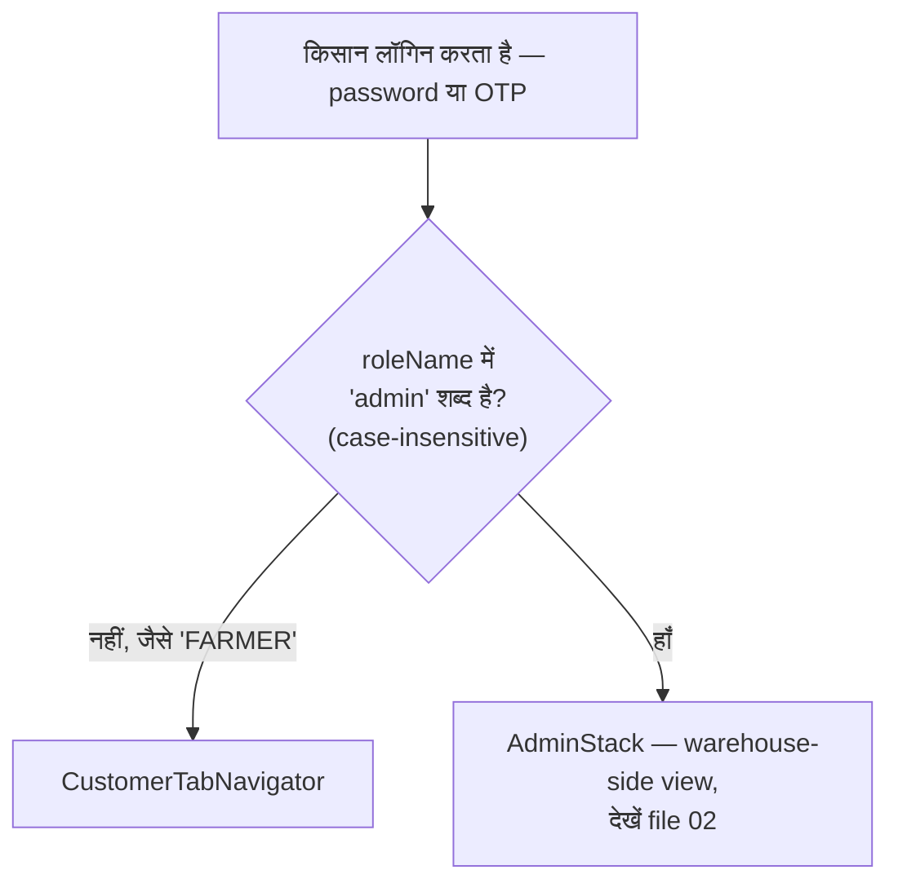
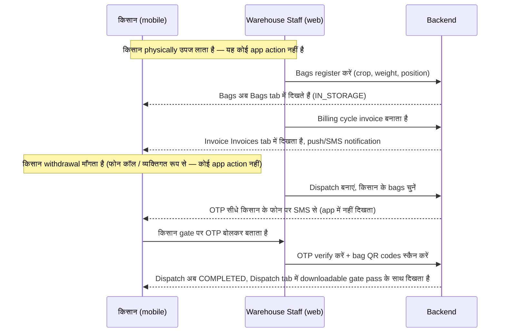

# 03 — Customer (किसान) मोबाइल ऐप वर्कफ़्लो

मोबाइल ऐप पर किसान (`FARMER`) को क्या दिखता है और वो क्या करता है। यही एक
role है (`FARMER`) जो web admin-dashboard को कभी छूता ही नहीं — सिस्टम से
उसका पूरा रिश्ता सिर्फ फोन के जरिए है।

---

## 1. वो किस ऐप में पहुँचता है, और क्यों

यह check सिर्फ एक लाइन है — `mobile/src/store/slices/authSlice.js`,
`selectIsAdmin`। एक `FARMER` account के role name में "admin" शब्द नहीं
होता, इसलिए वो हमेशा customer view में पहुँचता है: नीचे 5 tabs वाला
navigation — **Dashboard, Bags, Invoices, Dispatch, Profile**
(`CustomerTabNavigator.js`)।

---

## 2. Tab-by-tab

### Dashboard (`CustomerDashboardScreen.js`)
एक personalized greeting ("Good morning, {name}") के साथ खुलता है और तीन
stat cards दिखाता है, जो `GET /dashboard/summary` से आते हैं:

- **In Storage** — अभी कितने bags `IN_STORAGE` status में हैं
- **Dispatched Today** — आज कितने bags निकले
- **Pending Invoices** — कितने unpaid/partial invoices हैं

नीचे खींचकर refresh करें। अगर request fail हो (offline, server down), तो
चुपचाप zero दिखाने के बजाय retry state दिखाता है — यह production-hardening
के दौरान किए गए fixes में से एक था (देखें `mobile/PRODUCTION_NOTES.md`)।

### Bags (`shared/BagsScreen.js` — वही component जो admin की Bags list भी
इस्तेमाल करती है)
इस farmer के सारे bags की scrollable list — bag code, crop, weight,
status badge (In Storage / Reserved / Dispatched / Damaged), physical
position। एक बार में 20 load होते हैं और scroll करने पर अपने आप और आते
हैं (infinite scroll, "सब एक साथ load करो" नहीं — यह तब मायने रखता है
जब किसी farmer के पास कई seasons में सैकड़ों bags जमा हो जाएं)। किसी bag
पर टैप करने से मोबाइल पर अभी detail screen नहीं खुलती (उतनी detail —
movement history, quality reports — web admin की तरफ है); यह list
farmer का "अभी storage में मेरे पास क्या है" वाला view है।

### Invoices (`shared/InvoicesScreen.js`)
Status (Pending / Partial / Paid / Overdue), amount, और billing period
के साथ उनके invoices की list। **किसी invoice पर टैप करने से उसका PDF
download** होता है और फोन का native share sheet खुलता है — वहाँ से किसान
उसे save कर सकता है, print कर सकता है, या WhatsApp/email से आगे भेज सकता
है। (यह flow hardening के दौरान दोबारा बनाया गया था — PDF को disk पर
लिखकर OS के share sheet का इस्तेमाल करने के लिए, बजाय in-memory data URL
के जो iOS पर भरोसेमंद नहीं था।)

### Dispatch (`shared/DispatchScreen.js`)
उनके bags से जुड़े हर dispatch की history — vehicle number, driver name,
status। **किसी `COMPLETED` dispatch पर टैप करने से gate pass PDF
download** होता है, invoices जैसे ही तरीके से। एक `PENDING` dispatch
(reserve हुआ पर अभी gate-verify नहीं हुआ) दिखता तो है पर tap करने लायक
नहीं है — जब तक पूरा complete न हो, download करने को कुछ नहीं है।

### Profile (`ProfileScreen.js`)
उनका नाम, role, organization, एक **language toggle** (English/Hindi —
पूरे ऐप को instantly बदल देता है), एक **theme toggle** (light/dark), और
**Sign out** (confirmation dialog के साथ — sign out करते ही Keychain में
स्टोर tokens तुरंत साफ हो जाते हैं)।

---

## 3. किसान खुद क्या नहीं करता

यह समझना ज़रूरी है पूरी तस्वीर के लिए: किसान कभी अपने bags खुद register
नहीं करता, कभी अपना dispatch खुद नहीं बनाता, कभी अपना payment खुद दर्ज
नहीं करता। ये सब warehouse-staff के काम हैं (file 02)। किसान का role
downstream है — वो देखता है कि staff ने उसकी उपज के बारे में क्या दर्ज
किया है, और जब staff gate पर उसके bags release करते समय OTP भेजता है तो
वो उसे receive/इस्तेमाल करता है।

OTP जानबूझकर farmer के registered मोबाइल पर SMS से भेजा जाता है, ऐप के
अंदर नहीं दिखाया जाता — यह physical-world का handoff proof है कि gate पर
bags लेने वाला व्यक्ति सच में farmer से authorized है, चाहे उसके पास app
खुला हो या न हो, या smartphone हो भी या नहीं।

---

## 4. शुरू से अंत तक: एक किसान की पूरी lifecycle, tab-mapped

| असल दुनिया की घटना | कौन करता है | किसान को कहाँ दिखता है |
|---|---|---|
| उपज लेकर warehouse आता है | किसान (physical) | — |
| Staff भरे ट्रक को तौलता है | `OPERATOR` (web, Weighbridge) | — (सिर्फ internal record) |
| Staff bags register करता है | `OPERATOR`/`SUPERVISOR` (web, Inventory) | **Bags tab** — नई entries दिखती हैं, status `IN_STORAGE` |
| Staff quality check करता है | `SUPERVISOR` (web, Quality) | Bag के grade में दिखता है (web bag detail पर पूरा; mobile पर सिर्फ status) |
| Billing cycle चलता है | अपने आप / `ACCOUNTANT` | **Invoices tab** — नया invoice दिखता है |
| किसान पैसे देता है (cash/UPI office में) | `ACCOUNTANT` दर्ज करता है (web, Payments) | **Invoices tab** — status Partial/Paid हो जाता है |
| किसान withdrawal माँगता है | किसान (फोन/व्यक्तिगत) → staff dispatch बनाता है | **Dispatch tab** — नई entry, status `PENDING` |
| OTP भेजा जाता है | अपने आप (backend, dispatch बनते ही) | किसान के फोन पर SMS (app में नहीं) |
| Gate release | `SECURITY_GUARD`/`OPERATOR` OTP verify करता है + bags स्कैन करता है | **Dispatch tab** — status `COMPLETED` हो जाता है, gate pass downloadable; **Bags tab** — वो bags `DISPATCHED` हो जाते हैं |
