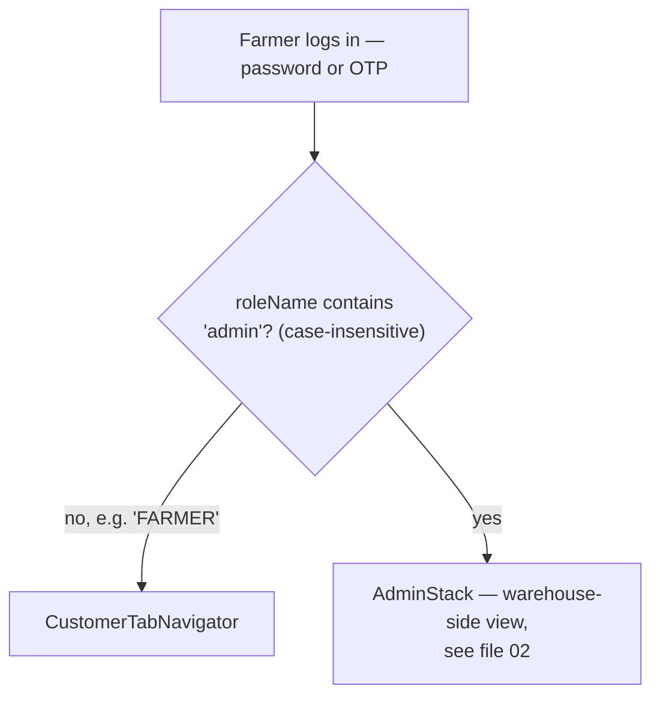
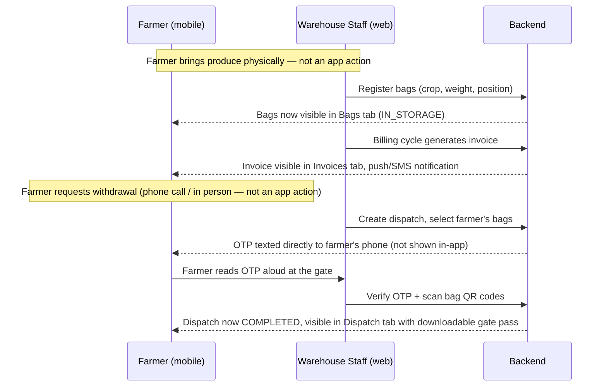

# 03 — Customer (Farmer) Mobile App Workflow

What a farmer sees and does on the mobile app. This is the one role
(`FARMER`) that never touches the web admin-dashboard at all — their
entire relationship with the system is through the phone.

---

## 1. Which app they land in, and why

This check is one line — `mobile/src/store/slices/authSlice.js`,
`selectIsAdmin`. A `FARMER` account's role name doesn't contain
"admin", so they always land in the customer view: a 5-tab bottom
navigation — **Dashboard, Bags, Invoices, Dispatch, Profile**
(`CustomerTabNavigator.js`).

---

## 2. Tab by tab

### Dashboard (`CustomerDashboardScreen.js`)
Opens to a personalized greeting ("Good morning, {name}") and three
stat cards pulled from `GET /dashboard/summary`:

- **In Storage** — how many of their bags are currently `IN_STORAGE`
- **Dispatched Today** — bags that left today
- **Pending Invoices** — how many unpaid/partial invoices they have

Pull down to refresh. If the request fails (offline, server down), it
shows a retry state instead of silently showing zeros — this was one of
the production-hardening fixes (see `mobile/PRODUCTION_NOTES.md`).

### Bags (`shared/BagsScreen.js` — same component the admin's Bags list uses)
A scrollable list of every bag belonging to this farmer — bag code,
crop, weight, status badge (In Storage / Reserved / Dispatched /
Damaged), physical position. Loads 20 at a time and fetches more
automatically as you scroll (infinite scroll, not "load everything at
once" — matters once a farmer has hundreds of bags across seasons).
Tapping a bag doesn't currently drill into a detail screen on mobile
(that level of detail — movement history, quality reports — lives on
the web admin side); this list is the farmer's "what do I have in
storage right now" view.

### Invoices (`shared/InvoicesScreen.js`)
List of their invoices with status (Pending / Partial / Paid /
Overdue), amount, and billing period. **Tapping an invoice downloads
its PDF** and opens the phone's native share sheet — from there the
farmer can save it, print it, or forward it via WhatsApp/email. (This
flow was rebuilt during hardening to write the PDF to disk and use the
OS share sheet, instead of an in-memory data URL that was unreliable on
iOS.)

### Dispatch (`shared/DispatchScreen.js`)
History of every dispatch involving their bags — vehicle number, driver
name, status. **Tapping a `COMPLETED` dispatch downloads the gate
pass PDF** the same way invoices do. A `PENDING` dispatch (reserved but
not yet gate-verified) is shown but not tappable — nothing to download
until it's actually completed.

### Profile (`ProfileScreen.js`)
Their name, role, organization, a **language toggle** (English/Hindi —
switches the whole app instantly), a **theme toggle** (light/dark), and
**Sign out** (with a confirmation dialog — signing out clears the
Keychain-stored tokens immediately).

---

## 3. What a farmer does NOT do themselves

This matters for understanding the full picture: a farmer never
registers their own bags, never creates their own dispatch, never
records their own payment. Those are warehouse-staff actions (file 02).
The farmer's role is downstream — they view what staff has recorded
about their produce, and they receive/act on the OTP that staff sends
when releasing their bags at the gate.

The OTP is deliberately sent via SMS to the farmer's registered mobile,
not surfaced inside the app — it's the physical-world handoff proof
that whoever is at the gate collecting the bags is actually authorized
by the farmer, independent of whether that person has the app open (or
a smartphone at all).

---

## 4. End-to-end: one farmer's full lifecycle, tab-mapped

| Real-world event | Who does it | Where it shows up for the farmer |
|---|---|---|
| Brings produce to warehouse | Farmer (physical) | — |
| Staff weighs the loaded truck | `OPERATOR` (web, Weighbridge) | — (internal record only) |
| Staff registers the bags | `OPERATOR`/`SUPERVISOR` (web, Inventory) | **Bags tab** — new entries appear, status `IN_STORAGE` |
| Staff runs a quality check | `SUPERVISOR` (web, Quality) | Reflected in the bag's grade (visible on web bag detail; mobile shows status only) |
| Billing cycle runs | Automatic / `ACCOUNTANT` | **Invoices tab** — new invoice appears |
| Farmer pays (cash/UPI at the office) | `ACCOUNTANT` records it (web, Payments) | **Invoices tab** — status flips to Partial/Paid |
| Farmer requests withdrawal | Farmer (phone/in-person) → staff creates dispatch | **Dispatch tab** — new entry, status `PENDING` |
| OTP sent | Automatic (backend, on dispatch creation) | SMS to farmer's phone (not in-app) |
| Gate release | `SECURITY_GUARD`/`OPERATOR` verifies OTP + scans bags | **Dispatch tab** — status flips to `COMPLETED`, gate pass downloadable; **Bags tab** — those bags flip to `DISPATCHED` |
